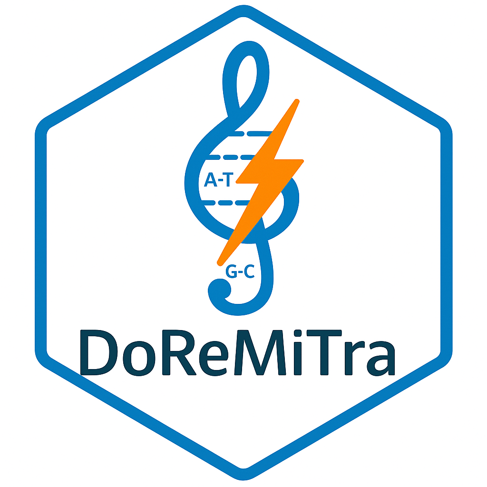

# DoReMiTra



**DoReMiTra:** A curated data package for radiation DOse REsponse Measured In TRAnscriptomics

It is an R data package providing access to curated transcriptomic datasets related to **blood radiation**, with a focus on **neutron, x-ray, and gamma ray** studies. It is designed to facilitate radiation biology research and support data exploration and reproducibility in radiation transcriptomics.

All datasets are provided as **SummarizedExperiment** objects, allowing seamless integration with the **Bioconductor ecosystem**.

------------------------------------------------------------------------

## Installation

You can install the development version of `DoReMiTra` from GitHub using:

``` r
# Install devtools if not already installed
install.packages("devtools")

# Install DoReMiTra from GitHub
devtools::install_github("AhmedSAHassan/DoReMiTra")
```

## Overview

The package includes preprocessed and annotated datasets from public repositories (primarily GEO), with harmonized metadata and consistent formatting. Datasets can be filtered by:

✅ Radiation type (neutron, x-ray, gamma ray)

✅ Organism (e.g., human, mouse)

✅ Experimental setting (InVivo, ExVivo)
